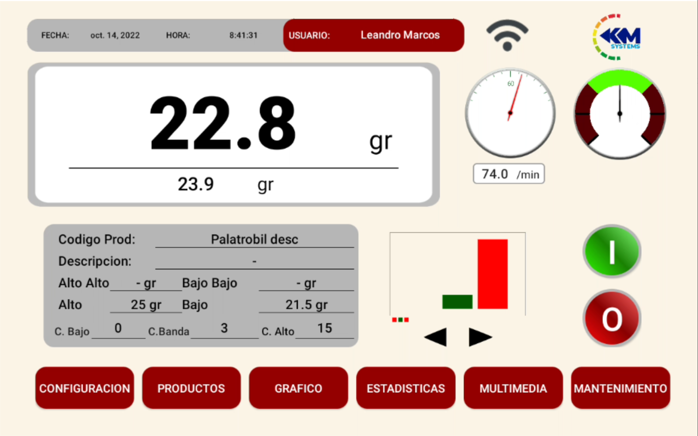
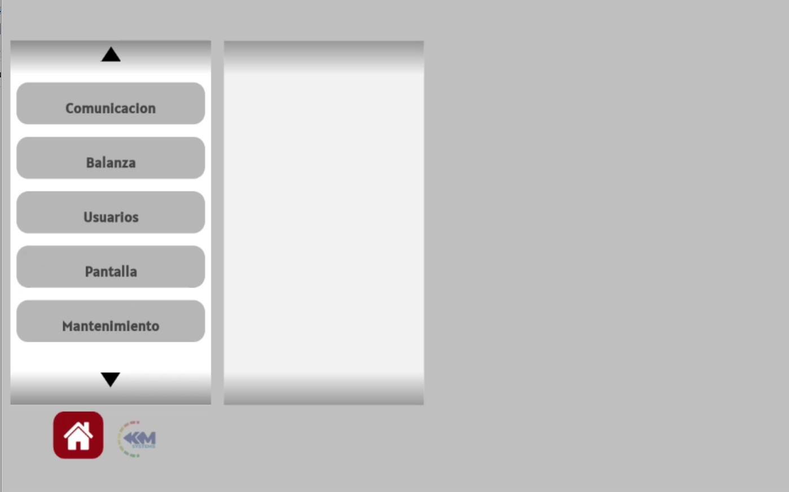

Pantalla Android Formulador con web embebida

Funcionalidades
--------
* Listado de productos con recetas configuradas para cada uno
* Muestra de estadisticas
* Grafico de una pesada para facilitar al operador el seteo y configuracion del producto
* Manuales dentro de la tablet para facilidad de los operadores
* Servidor FTP para tomar manuales, capturas de graficos y estadisticas, informes,etc

### Importacion

 git clone https://github.com/leandro160301/PH-480

### Desarrollado en Android Studio

 Firma de aplicacion: java -jar signapk.jar platform.x509.pem platform.pk8 app-debug.apk jwsapi.apk en la carpeta "security"

### Version

480 CHK 1.10
